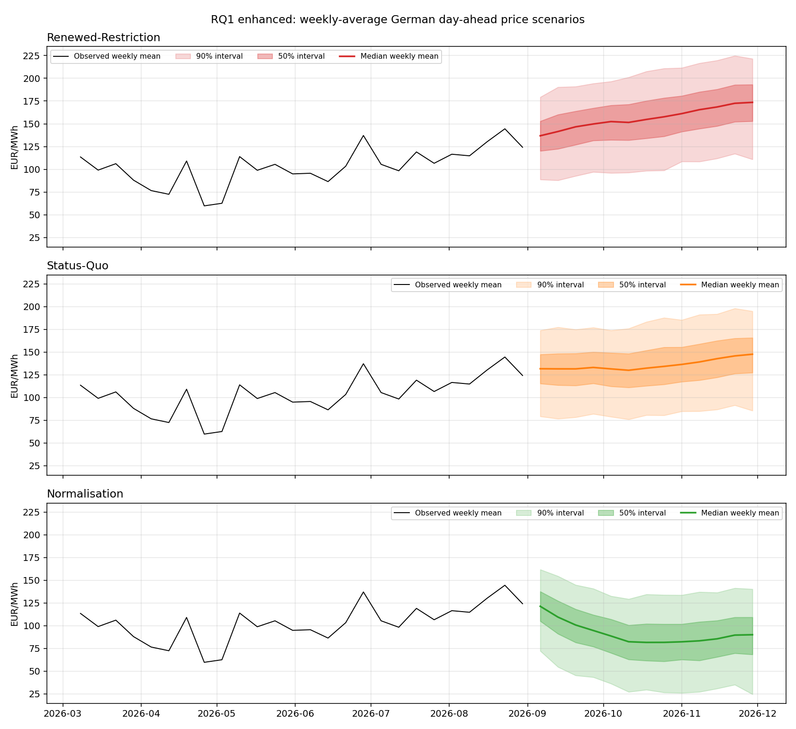
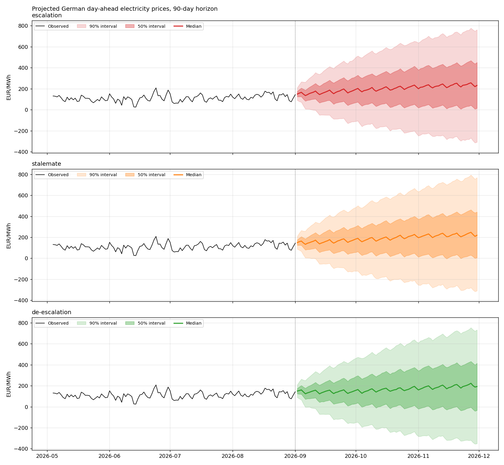
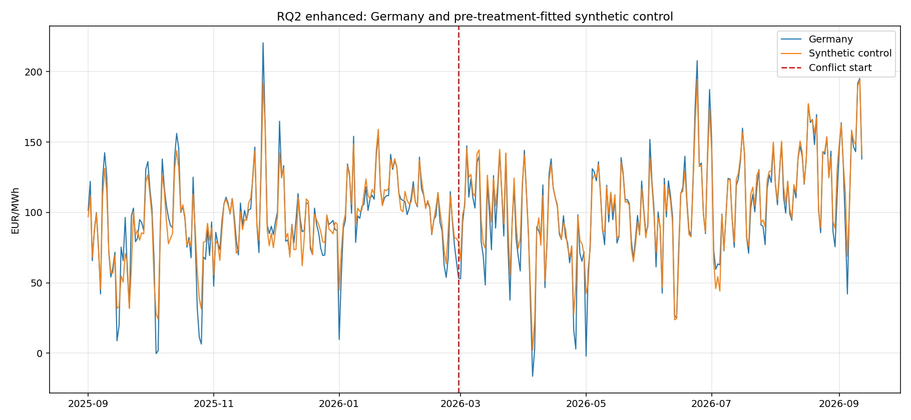
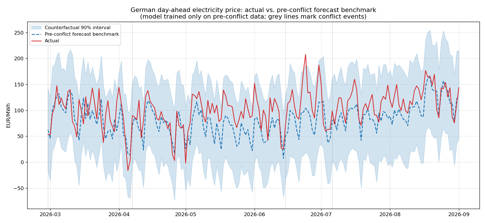
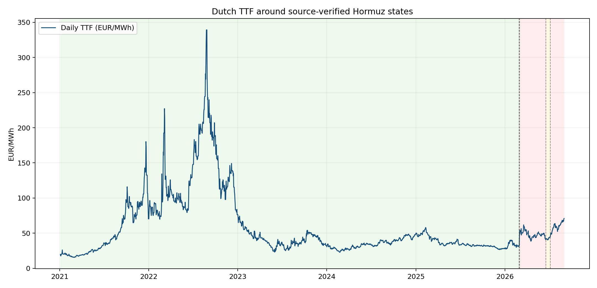
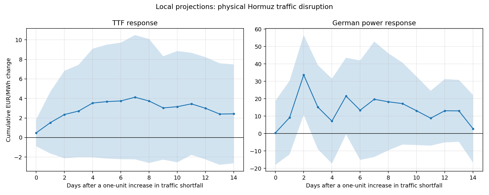
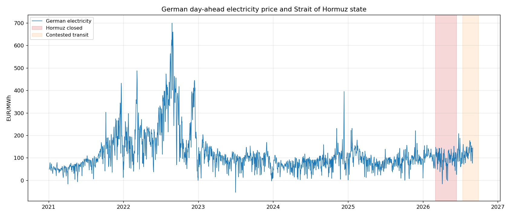

# Results

Every file here is generated by `run_pipeline.py`.
Raw-data cutoff `2026-09-12`; the common processed window ends `2026-09-01`.

### Provenance, stated exactly

The analysis was executed in separate sessions, so three manifests exist and
each covers only its own stages. Each hashes the scripts it ran and the
artifacts they produced:

| Record | Stages covered | Mode |
|---|---|---|
| [`run_manifest.json`](run_manifest.json) | `folds` through `scenario`: CV, Chronos, hybrid, ablation, significance, magnitude, transmission, Arm 4, Granger, diagnostics, scenarios | executed 2026-09-24 |
| [`phase1_run_manifest.json`](phase1_run_manifest.json) | `source_audit` through `rq4_eua_sensitivity` | executed |
| [`enhanced_run_manifest.json`](enhanced_run_manifest.json) | `enhancement_data`, RQ1/RQ2/RQ2a enhanced, `rq2a_event`, `rq4_compact` | verified staged recovery |

The input side is covered separately: [`../data/processed/manifest.json`](../data/processed/manifest.json)
records the SHA-256 of `master_features.csv` and of the raw manifest it was
built from, and states the lag policy. The collection and preprocessing stages
themselves are not re-executed here, because they need the two inputs that are
not redistributed (see the root README).

Rerunning any stage overwrites `run_manifest.json` with a record covering only
that stage.

### Reproduction check, 24 September 2026

Stages `folds` through `scenario` were re-executed end to end from the
committed `master_features.csv`, and every artifact reproduced
**byte-for-byte** apart from Prophet's uncertainty band.

Prophet draws that band by Monte Carlo, which was unseeded, so `cf_lower` and
`cf_upper` in [`magnitude_counterfactual.csv`](magnitude_counterfactual.csv)
moved between runs while the point forecast stayed fixed.
`12_magnitude_analysis.py` now seeds the draw before `predict`, and three
independent runs produce identical files. The seeded band differs from the
pre-seed one, which shifted the derived "days outside the 90% interval"
statistic in [`magnitude_summary.md`](magnitude_summary.md) from 0.5% to 1.1%.
Point estimates, actuals and excess values are unchanged to the digit,
including the +20.65 EUR/MWh mean deviation and the +90.09 EUR/MWh matched
2022 comparison.

One later edit postdates the manifests: `21_rq2a_event_table_study.py` had six
em dashes replaced with colons in the text it prints. Rerunning that stage
reproduced every CSV byte-for-byte and the chart pixel-for-pixel, with only the
separators in [`rq2a_event_summary.md`](rq2a_event_summary.md) changing, so the
script and summary hashes recorded in the two older manifests predate a
punctuation change with no numeric effect.

## Headline findings

| RQ | Question | Conclusion | Evidence |
|---|---|---|---|
| RQ1 | Price ranges under escalation, stalemate or de-escalation | Conditional weekly risk is highest under renewed restriction, but the scenario bands overlap | Week-13 medians EUR 173.57, 147.58 and 90.11/MWh; realised-driver coverage 87.2% against a nominal 90%; CRPS 16.92 |
| RQ2 | Magnitude of the conflict's impact on German prices | No positive Germany-specific average causal effect is established | Full-post synthetic-control gap -2.32 EUR/MWh, placebo p=0.7355 |
| RQ2a | Transmission channel and the role of Hormuz | State-to-TTF link is suggestive; TTF-to-power is a pooled association, not Hormuz-specific proof | 2 March TTF-window placebo p=0.0562; 1-14 day TTF-to-power cumulative +2.707 EUR/MWh per 1% TTF return |
| RQ3 | Which model forecasts best during a shock | Chronos has the lowest observed 2026 error, with no proven universal winner | Chronos 2026 MAE EUR 21.89/MWh |
| RQ4 | Which feature groups contribute to accuracy | Fundamentals help modestly; no significant EUA gain | [`rq4_compact_summary.md`](rq4_compact_summary.md), [`rq4_eua_block_length_sensitivity.csv`](rq4_eua_block_length_sensitivity.csv) |
| RQ5 | Does news coverage lead prices | Split finding: predictive value depends on window and variable | [`granger_summary.md`](granger_summary.md), [`granger_diagnostics_summary.md`](granger_diagnostics_summary.md) |

Full reasoning, caveats and the corrections applied: [`../docs/VALIDATED_RELEASE.md`](../docs/VALIDATED_RELEASE.md).

## Charts

### RQ1 : weekly scenario fan chart

Weekly-average price paths under renewed restriction, status quo and
normalisation, with block-resampled uncertainty bands.
Tables: [`scenario_weekly_projections.csv`](scenario_weekly_projections.csv),
[`scenario_weekly_validation.json`](scenario_weekly_validation.json),
[`short_term_14d_forecast.csv`](short_term_14d_forecast.csv).
Summary: [`scenario_weekly_summary.md`](scenario_weekly_summary.md).

### RQ1 : daily scenario engine

Gas-channel pass-through scenarios estimated in first differences.
Table: [`scenario_projections.csv`](scenario_projections.csv).
Summary: [`scenario_summary.md`](scenario_summary.md).

### RQ2 : European synthetic control

Germany against a donor-weighted European control, with time placebos.
Tables: [`rq2_estimands.csv`](rq2_estimands.csv),
[`rq2_synthetic_weights.csv`](rq2_synthetic_weights.csv),
[`rq2_time_placebos_full_post.csv`](rq2_time_placebos_full_post.csv).
Summary: [`rq2_enhanced_summary.md`](rq2_enhanced_summary.md).

### RQ2 : magnitude counterfactual

Weather-conditioned pre-event forecast deviation with matched 2022 comparison.
Tables: [`magnitude_counterfactual.csv`](magnitude_counterfactual.csv),
[`magnitude_event_car.csv`](magnitude_event_car.csv),
[`magnitude_placebo_tests.csv`](magnitude_placebo_tests.csv).
Summary: [`magnitude_summary.md`](magnitude_summary.md).

### RQ2a : Hormuz event study on TTF

Event windows around source-verified Hormuz state transitions.
Tables: [`rq2a_ttf_event_study.csv`](rq2a_ttf_event_study.csv),
[`rq2a_ttf_placebos.csv`](rq2a_ttf_placebos.csv),
[`rq2a_reclosure_sensitivity.csv`](rq2a_reclosure_sensitivity.csv),
[`rq2a_hormuz_daily_exposure.csv`](rq2a_hormuz_daily_exposure.csv).
Summary: [`rq2a_event_summary.md`](rq2a_event_summary.md).

### RQ2a : local projections

Impulse responses from continuous IMF PortWatch traffic shortfall.
Tables: [`rq2a_local_projections.csv`](rq2a_local_projections.csv),
[`rq2a_distributed_lag_chain.csv`](rq2a_distributed_lag_chain.csv).
Summary: [`rq2a_enhanced_summary.md`](rq2a_enhanced_summary.md).

### RQ2a : gas-to-power transmission

First-difference pass-through from TTF to German power by Hormuz state.
Table: [`hormuz_transmission.csv`](hormuz_transmission.csv).
Summary: [`hormuz_summary.md`](hormuz_summary.md).

## Model comparison and inference tables

- Forecast arms: [`../data/processed/chronos_zeroshot_results.csv`](../data/processed/chronos_zeroshot_results.csv), [`../data/processed/prophet_xgboost_results.csv`](../data/processed/prophet_xgboost_results.csv), [`arm4_results.csv`](arm4_results.csv)
- Ablation: [`../data/processed/ablation_results.csv`](../data/processed/ablation_results.csv)
- Significance: [`../data/processed/significance_tests.csv`](../data/processed/significance_tests.csv)
- RQ4: [`rq4_compact_results.csv`](rq4_compact_results.csv), [`rq4_compact_feature_importance.csv`](rq4_compact_feature_importance.csv), [`rq4_eua_block_bootstrap.csv`](rq4_eua_block_bootstrap.csv)
- RQ5: [`granger_results.csv`](granger_results.csv), [`granger_diagnostics.csv`](granger_diagnostics.csv)

## How to read these

- Forecast accuracy answers whether a signal improves prediction; it does not
  establish a price effect.
- The Prophet benchmark in the magnitude analysis is a model-based forecast
  deviation, not an identified causal counterfactual.
- Granger causality means predictive ordering, not structural causation.
- Scenario ranges are conditional sensitivities through an estimated gas
  channel, not forecasts of what will happen.
- Null findings are valid findings; claims use Holm-adjusted p-values,
  uncertainty intervals and effect sizes.
